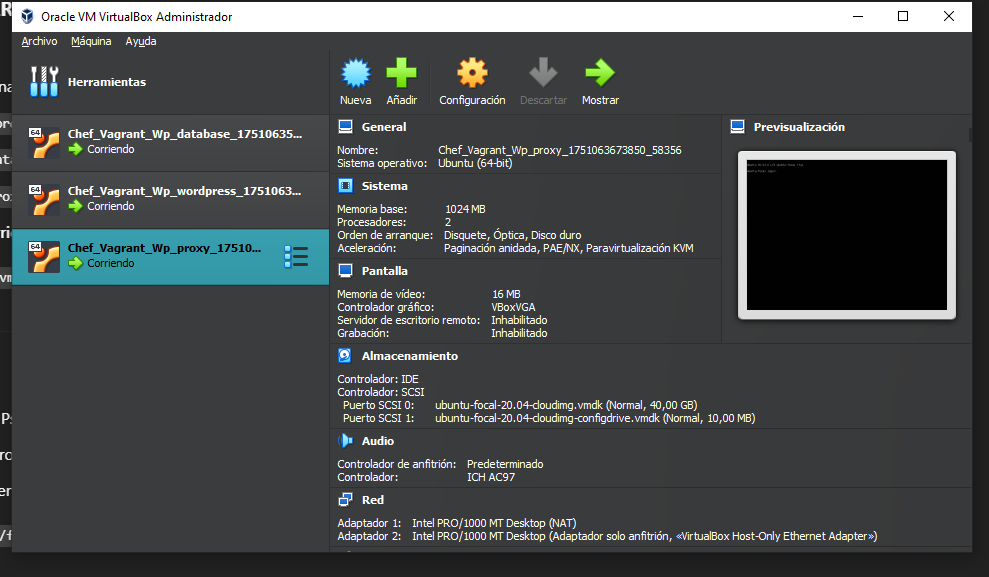
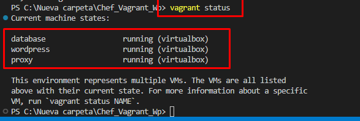
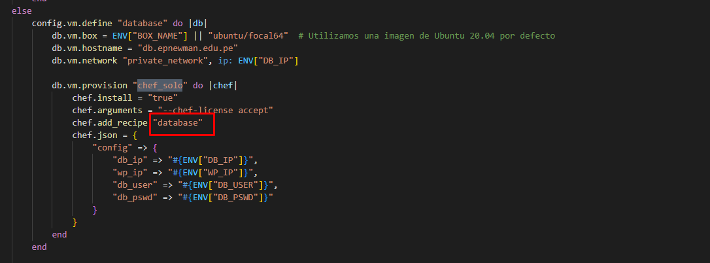
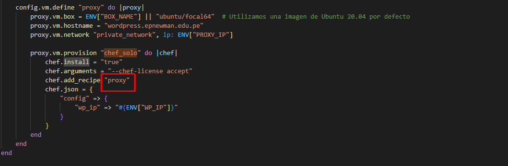
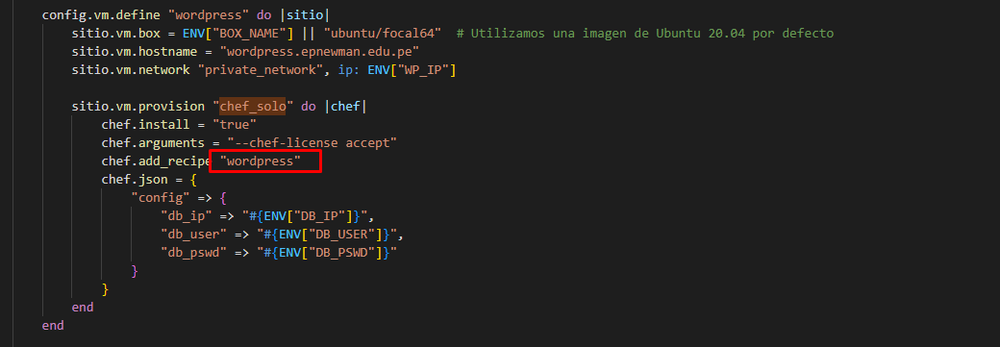
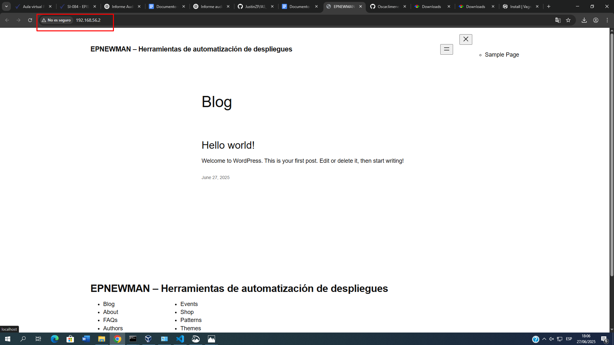

# INFORME DE AUDITORÍA TÉCNICA
**Despliegue de WordPress usando Vagrant y Chef**

## 1. INFORMACIÓN GENERAL

- **Nombre del estudiante:** Justin Zinedine ZEVALLOS PURCA  
- **Curso:** Auditoría de Sistemas  
- **Proyecto:** Despliegue de WordPress con Vagrant y Chef  
- **Fecha:** Junio 2025  
- **Repositorio GitHub:** [https://github.com/JustinZP/AS_U3_EXAMEN_PRACTICO.git](https://github.com/JustinZP/AS_U3_EXAMEN_PRACTICO.git)

---

## 2. OBJETIVO DE LA AUDITORÍA

Verificar la correcta automatización del despliegue de una infraestructura compuesta por tres máquinas virtuales: servidor de base de datos, servidor web con WordPress y servidor proxy, utilizando tecnologías como Vagrant y Chef. Se busca garantizar la trazabilidad, reproducibilidad y funcionamiento final de la aplicación WordPress.

---

## 3. ALCANCE DE LA AUDITORÍA

La auditoría contempla:
- La revisión del archivo `Vagrantfile` y recetas de Chef.
- La correcta creación y estado de las máquinas virtuales (`wordpress`, `database`, `proxy`).
- La ejecución de las recetas Chef sin errores.
- El funcionamiento final de WordPress accesible vía navegador web.
- Evidencias del proceso y análisis de configuración.

---

## 4. TECNOLOGÍAS UTILIZADAS

| Tecnología      | Versión             | Función                                         |
|----------------|---------------------|--------------------------------------------------|
| Vagrant        | 2.3.7 o superior     | Provisión y control de máquinas virtuales       |
| VirtualBox     | 7.0 o superior       | Entorno de virtualización de VMs                |
| Chef           | 17.x                | Herramienta de automatización de recetas        |
| Ruby           | 2.5 o superior       | Requisito de ejecución de Vagrant y Chef        |
| Sistema base   | Ubuntu 20.04 / CentOS 8 | Sistema operativo de las VMs               |

---

## 5. DETALLE DE LAS VERIFICACIONES

### 5.1. VMs desplegadas

Se desplegaron 3 máquinas virtuales:
- `Chef_Vagrant_Wp_wordpress`
- `Chef_Vagrant_Wp_database`
- `Chef_Vagrant_Wp_proxy`

Se verificó que están corriendo mediante `vagrant status`.

  

---

### 5.2. Vagrantfile

- Define las tres VMs con IPs privadas dentro del rango `192.168.56.0/24`.
- Se especifica el uso de provisioners Chef solo en las máquinas correspondientes.
- Las recetas están claramente organizadas.

  
  

---

### 5.3. Ejecución de recetas Chef

- Se configuraron servicios como **NGINX**, **PHP**, **MySQL** y **WordPress**.
- Se observó la ejecución de `service[nginx] restart`, indicando aplicación exitosa de configuración.
- No se detectaron errores en el log de la consola.

  
  

---

### 5.4. Acceso a WordPress

- WordPress es accesible desde [http://192.168.56.2/](http://192.168.56.2/) en el navegador.
- La interfaz de instalación se presenta correctamente.

---

## 6. CONCLUSIONES

- Las tres máquinas virtuales fueron desplegadas con éxito.
- Las recetas Chef se ejecutaron sin errores.
- WordPress es accesible en el navegador.
- Se cumple el principio de **Infraestructura como Código**.
- El entorno es reproducible en otros equipos siguiendo la misma configuración.

---

## 7. RECOMENDACIONES

- Documentar brevemente cada receta Chef para mejorar la mantenibilidad.
- Incluir un script de verificación automatizada (post-provisioning) para asegurar servicios activos.
- Usar variables en el `Vagrantfile` para hacer las IPs y nombres más reutilizables.

---

## 8. EVIDENCIAS Y ANEXOS

| Anexo  | Descripción                                                              |
|--------|--------------------------------------------------------------------------|
| 1      | Acceso a WordPress desde navegador – `despliegue_wordpress.png`         |
| 2      | Ejecución de recetas Chef – `Ejecución de recetas Chef.png`             |
| 3      | Logs adicionales de Chef – `Ejecución de recetas Chef_2.png`            |
| 4      | Reinicio de NGINX por Chef – `Ejecución de recetas Chef_3.png`          |
| 5      | Fragmento Vagrantfile database – `fragmentos_codigo_database.png`       |
| 6      | Fragmento Vagrantfile proxy – `fragmentos_codigo_proxy.png`             |
| 7      | Fragmento Vagrantfile wordpress – `fragmentos_codigo_wordpress.png`     |
| 8      | Estado de VMs en terminal – `vagrant_status_terminal.png`               |
| 9      | Visualización VMs en VirtualBox – `vm_virtualbox.png`                   |

---

> **Repositorio GitHub:** [https://github.com/JustinZP/AS_U3_EXAMEN_PRACTICO.git](https://github.com/JustinZP/AS_U3_EXAMEN_PRACTICO.git)
